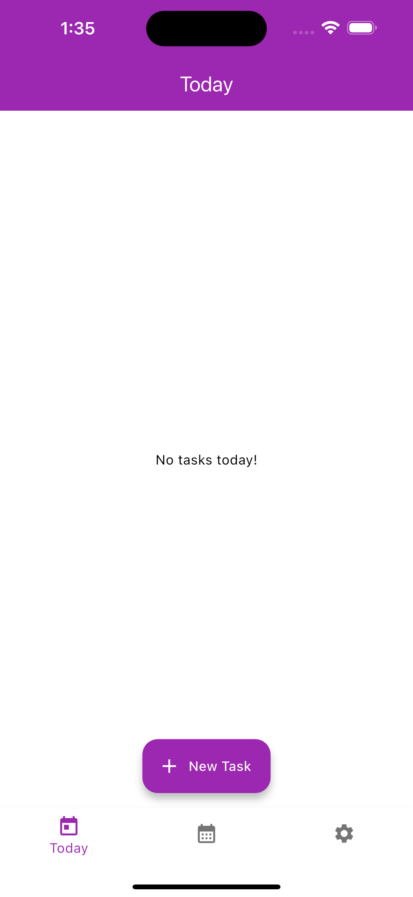
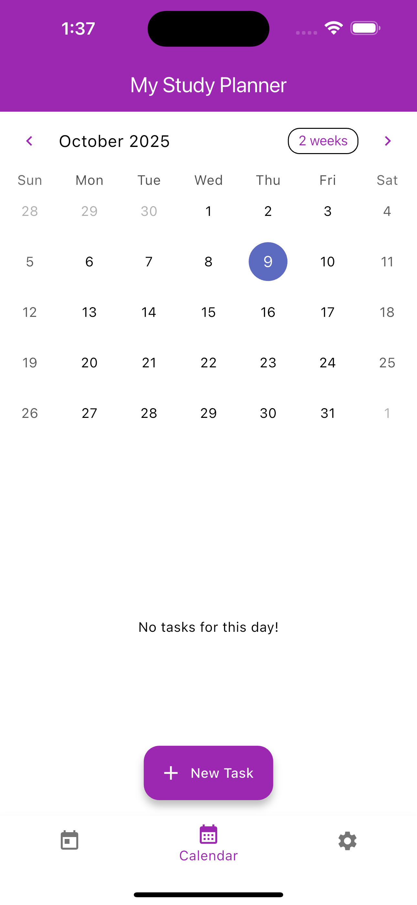
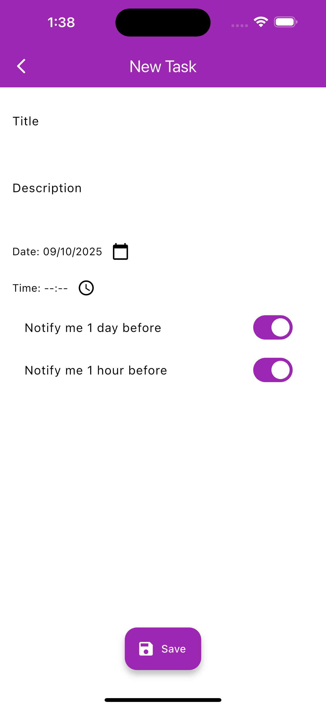

# 📚 Study Planner App

A Flutter-based mobile application designed to help students plan, manage, and organize their study tasks efficiently.  
This project was developed as part of an educational assignment to gain hands-on experience with **multi-screen apps**, **navigation**, and **local data storage** in Flutter.

---

## 🧩 Project Overview

The **Study Planner App** allows users to:

- Create, view, and manage study tasks.
- Set due dates and optional reminder times.
- View tasks in both **Today’s View** and a **Monthly Calendar View**.
- Save all tasks locally using either `SharedPreferences` or `SQLite`.
- Enable or disable reminders from the **Settings Screen**.

---

## 🚀 Features

### 📝 Task Management
- Add new tasks with:
  - **Title** (required)
  - **Description** (optional)
  - **Due Date** (required)
  - **Reminder Time** (optional)
- View all tasks for **today**.
- Select any date to view its associated tasks.
- *(Bonus)* Edit or delete existing tasks.

### 📅 Calendar View
- Displays a **monthly calendar** with highlighted dates that have tasks.
- Tapping a date shows tasks scheduled for that day.

### ⏰ Reminder System
- Users can set optional reminder times.
- Simulated pop-up reminders when the app launches.

### 💾 Local Storage
- Supports two storage options:
  - `shared_preferences` — saves tasks as JSON.
  - `sqflite` — stores tasks in a SQLite database.

### 🧭 Navigation
- Bottom Navigation Bar with:
  - **Today** – daily tasks  
  - **Calendar** – monthly calendar + daily tasks  
  - **Settings** – reminder toggle & storage info

### ⚙️ Settings
- Enable or disable reminders.
- Display current storage method in use.

---

## 🖼️ Screenshots

| Screen | Preview |
|--------|----------|
| Splash Screen |  |
| Today Screen |  |
| Calendar View |  |
| New Task |  |


---

## 🧱 Project Structure

lib/
├── main.dart
├── screens/
│ ├── today_screen.dart
│ ├── calendar_screen.dart
│ └── settings_screen.dart
├── models/
│ └── task_model.dart
├── widgets/
│ ├── task_tile.dart
│ └── calendar_widget.dart
└── services/
├── database_helper.dart
└── preferences_service.dart


---

## ⚙️ Installation & Setup

### Prerequisites
- Flutter SDK installed  
- Android Emulator or Physical Device

### Steps to Run

```bash
# Clone the repository
git clone https://github.com/Kodedbykenzie/study-planner-app.git

# Navigate into the project
cd study-planner-app

# Install dependencies
flutter pub get

# Run the app
flutter run

🧠 Learning Objectives

This project demonstrates:

Building multi-screen Flutter apps with navigation.

Applying Material Design for UI.

Managing state and local data persistence.

Implementing reminder simulations.

Using Flutter documentation effectively.

👩‍💻 Developer Info

Developer: Precious (Kodedbykenzie)
Course: Software Engineering — Mobile App Development
Assignment: Study Planner App
Repository: GitHub Link

📄 Submission Details

Submission format:

PDF document containing:

Link to this GitHub repository

Link to the demo video

Filename format:
your_emailID_StudyPlannerApp.pdf

🔗 References

Flutter Official Documentation

sqflite Package

shared_preferences Package

📝 “Plan your study, plan your success!”


---

#### 4️⃣ Save the file  
Then push it to GitHub:

```bash
git add README.md
git commit -m "Updated clean README"
git push
