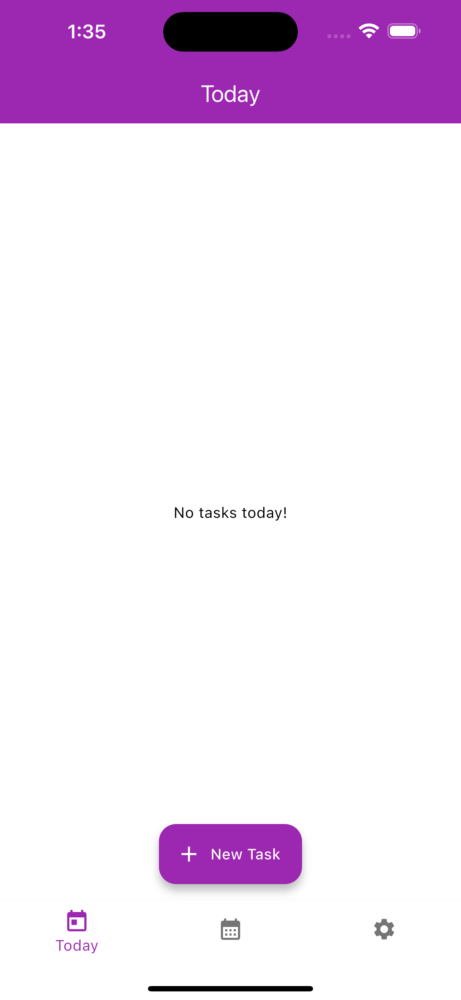
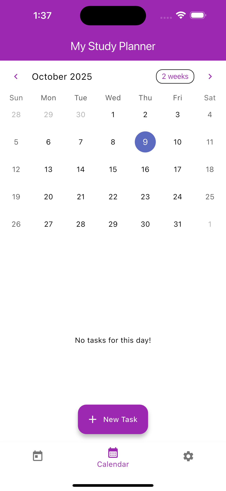
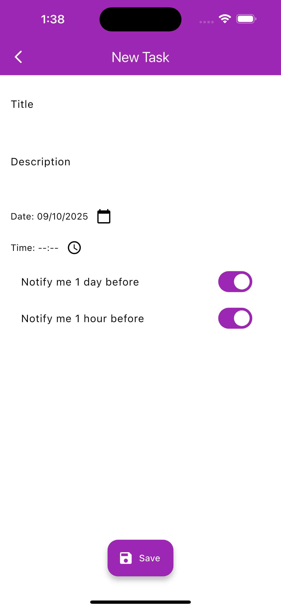

Perfect 👍 — since this is a **Flutter Study Planner App** assignment, your README should clearly explain what the app does, how to run it, and show screenshots to make your repo professional.

Here’s a well-structured **README.md** you can copy into your project’s root folder (just name it `README.md`).
I’ve also included placeholders where you can later add screenshots and your video link.

---

```markdown
# 📚 Study Planner App

A Flutter-based mobile application designed to help students plan, manage, and organize their study tasks efficiently.  
This project was developed as part of an educational assignment to gain hands-on experience with **multi-screen apps**, **navigation**, and **local data storage** in Flutter.

---

## 🧩 Project Overview

The **Study Planner App** allows users to:
- Create, view, and manage study tasks.
- Set due dates and optional reminder times.
- View tasks in both **Today’s View** and a **Monthly Calendar View**.
- Save all tasks locally using either `SharedPreferences` or `SQLite`.
- Enable or disable reminders from the **Settings Screen**.

---

## 🚀 Features

### 1. Task Management
- Add new tasks with:
  - **Title** (required)
  - **Description** (optional)
  - **Due Date** (required)
  - **Reminder Time** (optional)
- View all tasks for **today**.
- Select any date to view its associated tasks.
- *(Bonus)* Edit or delete existing tasks.

### 2. Calendar View
- Displays a **monthly calendar** with highlighted dates that have tasks.
- Tapping on a date shows the list of tasks for that day.

### 3. Reminder System
- Users can set optional reminder times.
- Simulated reminders via pop-up/alert dialogs when the app launches.

### 4. Local Storage
- Supports two storage options:
  - `shared_preferences` — saves tasks as JSON.
  - `sqflite` — stores tasks in a structured SQLite table.

### 5. Navigation & Screens
- Bottom Navigation Bar includes:
  - 🗓 **Today** — shows today’s tasks.
  - 📅 **Calendar** — monthly calendar + daily tasks.
  - ⚙️ **Settings** — reminder toggle & storage info.

### 6. Settings
- Enable/disable reminders.
- Display current storage method in use.

---

## 🖥️ Screenshots

| Screen | Preview |
|--------|----------|
| Splash Screen |  |
| Today Screen |  |
| Calendar View |  |
| New Task |  |

> 🖼️ **Tip:** Add your app screenshots inside a folder named `screenshots/` in your project root, then update the file names above.

---

## 🧱 Project Structure

```

lib/
├── main.dart
├── screens/
│   ├── today_screen.dart
│   ├── calendar_screen.dart
│   └── settings_screen.dart
├── models/
│   └── task_model.dart
├── widgets/
│   ├── task_tile.dart
│   └── calendar_widget.dart
└── services/
├── database_helper.dart
└── preferences_service.dart

````

---

## ⚙️ Installation & Setup

### Prerequisites
- Flutter SDK installed  
- Android Emulator or Physical Device

### Steps to Run
```bash
# Clone the repository
git clone https://github.com/Kodedbykenzie/study-planner-app.git

# Navigate into the project
cd study-planner-app

# Install dependencies
flutter pub get

# Run the app on emulator/device
flutter run
````

---

## 🧠 Learning Objectives

This project demonstrates:

* Building **multi-screen apps** with navigation.
* Using **Material Design** components for UI.
* Managing **state and data persistence** locally.
* Implementing **reminder simulations**.
* Applying **Flutter documentation** to real-world app development.

---

## 🧑‍💻 Developer Info

**Developer:** Precious (Kodedbykenzie)
**Course:** Software Engineering — Mobile App Development
**Assignment:** Study Planner App
**Repository:** [GitHub Link](https://github.com/Kodedbykenzie/study-planner-app)

---

## 📄 Submission Details

**Submission format:**

* PDF document with:

  * Link to this GitHub repository.
  * Link to the demo video.
* Filename format:
  `your_emailID_StudyPlannerApp.pdf`

---

## 🧭 References

* [Flutter Official Documentation](https://docs.flutter.dev/)
* [sqflite Package](https://pub.dev/packages/sqflite)
* [shared_preferences Package](https://pub.dev/packages/shared_preferences)

---

> 📝 *"Plan your study, plan your success!"*

```
